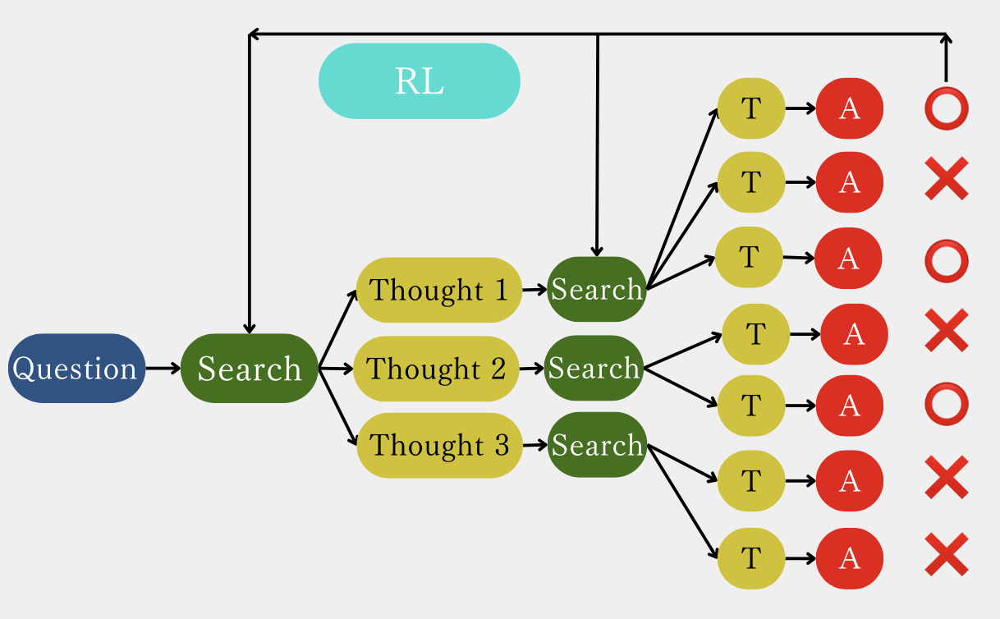
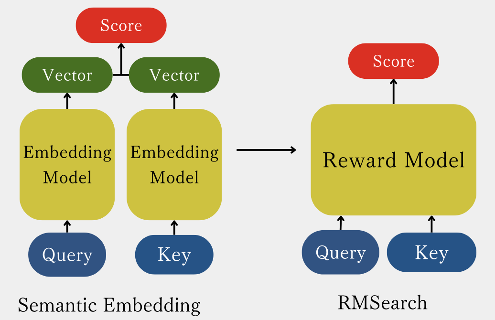
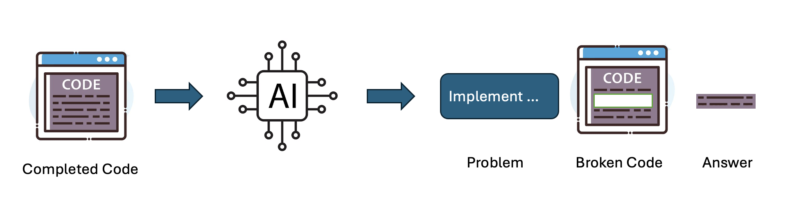
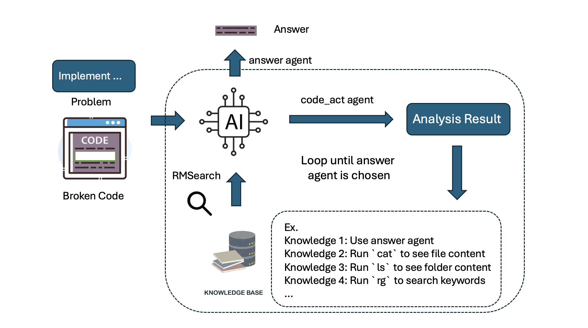
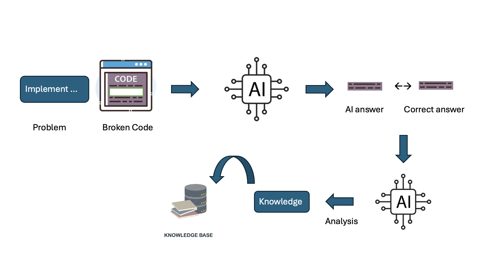
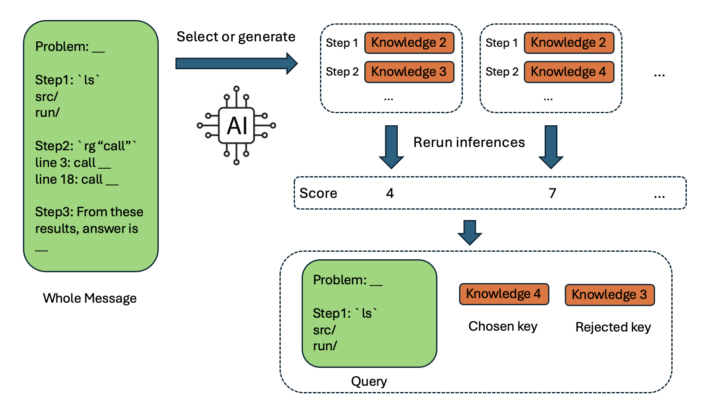

# LLM-Assisted Plasma Simulation Code Automation: Draft 2

**Kentaro Seki** (seki.kentaro.66s@st.kyoto-u.ac.jp)  
Kyoto University  
*Date: today*

## Abstract

## Contents

- [1. Introduction](#1-introduction)
  - [1.1 Motivation](#11-motivation)
  - [1.2 Current Development on Large Language Models](#12-current-development-on-large-language-models)
  - [1.3 SEIMEI](#13-seimei)
  - [1.4 RMSearch](#14-rmsearch)
  - [1.5 Goal of our research](#15-goal-of-our-research)
  - [1.6 Related Research](#16-related-research)
- [2. Approach](#2-approach)
  - [2.1 Overview](#21-overview)
  - [2.2 Dataset Creation](#22-dataset-creation)
  - [2.3 Inference Pipeline](#23-inference-pipeline)
  - [2.4 Knowledge Generation](#24-knowledge-generation)
  - [2.5 Dataset for RMSearch](#25-dataset-for-rmsearch)
  - [2.6 RMSearch Training](#26-rmsearch-training)
  - [2.7 RMSearch & Inference Evaluation](#27-rmsearch--inference-evaluation)
- [3. Experiment](#3-experiment)
  - [3.1. "rmsearch-plasma-1.0" Evaluation](#31-rmsearch-plasma-10-evaluation)
  - [3.2. "seimei-plasma-1.0" Evaluation](#32-seimei-plasma-10-evaluation)
- [4. Discussion](#4-discussion)
- [5. Conclusion](#5-conclusion)
- [References](#references)

## 1. Introduction

### 1.1 Motivation

Modern nuclear-fusion research relies heavily on **gyrokinetic simulation**, which reduces the full 6D kinetic plasma problem into a more tractable form while preserving key microturbulence physics. This shift enabled “first-principles” turbulence studies and transport predictions that are difficult to obtain experimentally, and it is now routine to use large gyrokinetic codes for tokamak/stellarator turbulence and validation studies (e.g., GENE, GS2, GTC, GKV and related validation work). ([MPG.PuRe][1])

However, **gyrokinetic simulation software is hard to extend**:

* **Large, interdependent codebases**: physics modules (e.g., collisions, electromagnetic terms, geometry, diagnostics) are spread across many files and abstraction layers.
* **High “cost per new feature”**: adding a seemingly small physics change (example: a new collision operator term, a new equilibrium interface, or a new diagnostic) often forces edits in multiple places: data structures, solvers, I/O, tests, and documentation.
* **High onboarding cost**: new contributors must learn both the physics and the code architecture before making safe changes.

Large Language Models (LLMs) are becoming practical tools for software development and scientific workflows, especially when paired with **external knowledge, tools, and structured agent pipelines**. This motivates building an LLM system that helps fusion researchers (1) understand unfamiliar parts of a codebase faster, and (2) implement changes more reliably—ultimately accelerating iteration cycles for simulation studies.

---

### 1.2 Current Development on Large Language Models

The last several years produced a “stack” of advances that (together) explain why modern LLM systems can help with non-trivial scientific coding.

#### (1) Transformers

Most modern LLMs are based on the **Transformer**, which replaces recurrence with **self-attention**. Intuitively:

* In an RNN, information must flow step-by-step through time.
* In a Transformer, each token can “look at” other tokens directly (through attention), which enables **parallel training** and better long-range dependency handling.

This architecture made it feasible to scale training to very large datasets and models while keeping optimization stable. ([arXiv][2])

#### (2) Scaling laws (and compute-optimal training)

Scaling law work observed that model loss often follows **smooth power-law trends** as you increase model size, data size, and compute—meaning progress can be predicted and engineered. ([arXiv][3])
Later work showed that, under a fixed compute budget, many LLMs were “undertrained” on too few tokens, motivating **compute-optimal** training strategies (often summarized via the “Chinchilla” perspective). ([arXiv][4])

Why this matters for scientific coding: scaling isn’t just “bigger is better”—it also teaches how to spend compute efficiently, which becomes important when we later discuss RL-based post-training costs.

#### (3) InstructGPT / RLHF (often PPO-based)

Base LLMs are trained to predict the next token, not to follow instructions. InstructGPT-style pipelines added a practical recipe:

1. Collect **human-written demonstrations** (supervised fine-tuning).
2. Collect **human preference rankings** over model outputs.
3. Train a **reward model** to predict those preferences.
4. Optimize the policy using RL (often **PPO**) to improve reward while limiting drift from the base model.

This line of work improved instruction-following and user preference alignment—even showing cases where a much smaller aligned model is preferred to a much larger base model. ([arXiv][5])
The broader “learning from preferences” setup is also well-established in RL. ([arXiv][6])

#### (4) DPO (Direct Preference Optimization)

DPO reframes preference optimization as a **simple classification-like objective** that can match RLHF-style goals (reward maximization with KL constraint) without running full RL rollouts. Practically, that means:

* No explicit reward model is required at training time (it’s “implicit”).
* Training looks closer to supervised fine-tuning, often simplifying stability and reducing engineering overhead.

This matters for us because we want a training loop that is realistic for academic GPU budgets. ([arXiv][7])

#### (5) DeepSeek-R1-style reasoning-focused post-training

Recent reasoning-focused model releases and reports (e.g., DeepSeek-R1) highlight renewed emphasis on **reinforcement learning / preference optimization** as a path to stronger reasoning behavior, often combined with careful data and evaluation design. ([arXiv][2])

For our paper’s narrative, the key point is not “one model is best,” but that the field trend increasingly treats **post-training (preferences, RL, or RL-free variants like DPO)** as a major lever for reasoning and reliability.

#### (6) Test-time compute (inference-time search)

Even without changing model weights, you can often improve reasoning by spending **more computation at inference time**. Common patterns:

* **Chain-of-thought prompting**: ask the model to write intermediate steps. ([OpenReview][8])
* **Self-consistency**: sample multiple reasoning traces and pick the majority-consistent answer. ([Astrophysics Data System][9])
* **Tree of Thoughts (ToT)**: explicitly search a tree of partial solutions, backtrack, and evaluate branches. ([OpenReview][10])

A simple analogy: instead of trusting the first draft, you ask the model to generate multiple candidate “proof attempts,” then select or refine the best. This “test-time search” theme is directly relevant to agentic coding pipelines, where we can try multiple patch candidates and score them.

#### Why RL can help, and why it can be expensive

Empirically, preference/RL-style post-training often improves **instruction following** and sometimes **reasoning benchmark performance**, but it can be resource-intensive because it requires generating many samples (rollouts) and performing multiple optimization steps (e.g., PPO). ([arXiv][5])
This motivates exploring **RL-free** (or “more supervised-like”) alternatives such as DPO where appropriate. ([arXiv][7])

---

### 1.3 SEIMEI

In this work we use **SEIMEI**, an open-source library that orchestrates LLM-based inference as a **search-integrated agent pipeline**. Conceptually, SEIMEI is designed for tasks requiring domain-specific knowledge and reasoning. SEIMEI realizes this by reinforcement-learning on search model which integrates agents and knowledge. ([GitHub][12])

Figure | SEIMEI's inference and learning pipeline. Reinforcement-learning on search model improves the model reasoning path through guiding its thought.

Key idea (plainly): instead of training LLM on next token prediction task, SEIMEI **trains search model to guide inference**. This feature has the following advantage over the previous method.
1. Training search model doesn't break the core inference LLM, which prevents core inference collapsion (!need to add continuous learning sitation). 
2. Adapting search model to one domain requires much less calculation cost than training next-token-generation LLM.

**Search** has been a key technology for knowledge expansion. Search-engine has connected numerous amount of documents created by citizens and enabled human-beings to enhance the whole search-engine system by adding their own knowledge. This flexiblity to adding knowledge is key to expanding knowledge for an AI system. SEIMEI has a potential to become a new AI system - search model integrates not only simple knowledge but also how to think - beyond current workflow agent paradigm.

---

### 1.4 RMSearch

SEIMEI’s routing and knowledge selection use **RMSearch**, a “reward-model-style” search/reranking component. RMSearch is used to retrieve and prioritize helpful snippets (knowledge, prior solutions, docs, heuristics) that augment the LLM’s next step. ([GitHub][12])

Architecturally, RMSearch is closest to a **reranker**: given a query and candidate texts, it scores query–candidate relevance (often with a cross-encoder-like setup). This is aligned with a long line of reranking research, including BERT-style rerankers and efficient interaction models. ([arXiv][13])

Why reranking matters for scientific coding: for a large codebase, the main failure mode is often not “the model can’t write code,” but “the model used the wrong assumptions / wrong file / wrong function contract.” Strong retrieval/reranking reduces those errors by forcing the model to ground its edits in the right local context.

---

### 1.5 Goal of our research

We aim to improve LLM-assisted **plasma simulation code writing/editing** using SEIMEI + RMSearch, with an emphasis on gyrokinetic code (GKV). Our plan:

1. Build an inference system using SEIMEI.
2. Generate a dataset from a real gyrokinetic codebase.
3. Generate a **knowledge pool** by solving/repairing tasks (and extracting reusable lessons).
4. Train RMSearch (reranker-style) over that knowledge pool using preference-style data (DPO).
5. Measure whether the knowledge pool + trained RMSearch improves code-repair accuracy in the same domain.

(Experiments/results are not included in this baseline draft, per your request.)

---

### 1.6 Related Research

Below are the main research threads we build on; this section is intentionally plain and cross-disciplinary.

#### Retrieval-Augmented Generation (RAG)

RAG methods attach an external memory (documents, snippets, code, papers) to an LLM so it can **retrieve** relevant context rather than relying only on parameters. The core motivation is modularity:

* You can update knowledge by updating the corpus/index, without retraining the whole model.
* You can attach provenance (“this answer used these sources”).

Classic RAG work combines a neural retriever with a generator for knowledge-intensive tasks. ([arXiv][14])
Related lines include retrieval during pretraining (REALM) ([arXiv][15]) and retrieval-enhanced generation at very large scale (RETRO). ([arXiv][16])
Dense retrieval also became a standard baseline for open-domain QA and retrieval pipelines. ([arXiv][17])

**Why it matters here:** codebases are “documents.” A fusion code repository contains the ground truth for function contracts, data layouts, and physics assumptions. RAG-style grounding reduces hallucinated edits.

#### AI agents (tool use, browsing, iterative editing)

Modern “LLM agents” combine a language model with tools and iterative control:

* Tool use learned or prompted (e.g., Toolformer). ([arXiv][18])
* Modular architectures mixing LMs with specialized components (MRKL). ([arXiv][19])
* Reason+act prompting patterns (ReAct), useful for multi-step tasks. ([GitHub][20])
* Web/tool-assisted answering and reference collection (WebGPT), relevant for grounded reasoning workflows. ([arXiv][21])
* Software-engineering agents with repository navigation and editing interfaces (SWE-agent). ([arXiv][22])

Agent frameworks in practice often emphasize *interfaces* (file editing, running checks, browsing) rather than only better prompts—this aligns with our SEIMEI design goal of structured code repair. ([arXiv][22])

#### DSPy (automatic pipeline improvement from evaluation)

DSPy proposes a programming model where you declare an LLM pipeline, define a metric, and let a compiler-like optimizer improve prompts/modules using data. ([arXiv][23])

**Connection to our goal:** we also want an “evaluation-driven improvement loop,” but focused on (a) code repair tasks, and (b) improving retrieval/reranking (RMSearch) and knowledge pools that feed the pipeline.

#### Reranker models (relevance scoring)

Rerankers are a standard IR technique: a fast retriever gets candidates; a stronger model reorders them. BERT reranking (monoBERT) demonstrated large gains in passage ranking. ([arXiv][13])
ColBERT provides an efficiency–quality tradeoff via late interaction. ([arXiv][24])

**Connection to our work:** RMSearch plays the reranker role for “which knowledge or context should the agent use next,” which becomes crucial in specialized domains like gyrokinetics.

---

## 2. Approach

### 2.1 Overview

Our approach is an end-to-end loop that turns a real fusion codebase into (1) code-repair tasks, (2) an agentic inference pipeline, and (3) training data for a domain-adapted reranker (RMSearch):

1. **Dataset creation**: intentionally break code, then create a question that asks for a repair.
2. **Inference pipeline**: given (question, broken code), generate a patch/repair candidate.
3. **Scoring**: evaluate candidate repairs (static checks, diff quality, possibly tests/compilation when available).
4. **Knowledge generation**: collect reusable “lessons” from successful (and failed) repairs.
5. **RMSearch dataset construction**: create preference pairs over candidate knowledge/context and/or candidate repairs.
6. **Train RMSearch** (DPO-style preference optimization).
7. **Evaluate**: run the inference pipeline again, now routed/augmented by trained RMSearch.

This is designed to be feasible without full RLHF infrastructure, while still leveraging preference-style learning.

---

### 2.2 Dataset Creation

Figure | Dataset generation pipeline. Make LLM intentianlly break complete code and generate problem related to repairing the code snippet.

**Target repository:** we use the open gyrokinetic Vlasov simulation code **GKV (gkvp)** as the source code to generate dataset from. ([GitHub][25])

**Task type (plain description):** “repair the code so it matches the original intended physics-aware behavior.”

Concretely, for a given file:

1. An LLM selects **which line(s) to break**, with the constraint that the deletion should affect **core physics logic** (not only comments or trivial formatting).
2. The pipeline generates:

   * a **patch** that removes important lines,
   * a **question** describing the observed failure or missing behavior (“restore the missing computation / boundary condition / term”) and ask LLM to fix the issue.

Why “break-and-repair” is useful:

* **Correctness:** It provides a clean answer patch because the correct fix is known. LLM can easily check if the LLM output is correct by comparing it with the original code.
* **Scalability:** This method only requires complete code and LLM request. It can be easily scaled to other complete code about plasma physics or even to other fields.
* **Realistic:** It creates physics-centered code edition problem which researchers often encounter in small code addition or fix related to plasma equations.

---

### 2.3 Inference Pipeline

We implement the inference loop using SEIMEI. ([GitHub][12])

There are basically 2 agents used in analyzing gkv code. 

* **code_act agent**: runs unix command (ex. `cat`, `ls`, `rg`) or python code to analyze local folder and files.
* **answer agent**: gives final answer summarizing all the analysis result of code_act agent

This aligns with patterns demonstrated in prior agent work for tool use and repository-scale editing:

* **ReAct**-style reasoning+acting loops for stepwise progress. ([GitHub][20])
* Tool-augmented LMs (Toolformer) and modular systems (MRKL). ([arXiv][18])
* SWE-agent shows that carefully designed “agent–computer interfaces” improve code-editing success on benchmarks. ([arXiv][22])
* OpenHands is an example of an open platform focused on coding agents. ([GitHub][26])

Compared to the methods above, SEIMEI has an additional feature, **Routing and augmentation:** at each step, SEIMEI can call RMSearch to retrieve domain-relevant knowledge snippets, then incorporate them into the next model call. ([GitHub][12])

We use RMSearch for integrating search model rather than conventional semantic-embedding model. It is because RMSearch, often refered to as reranker model, calculates relevance-score more directly and therefore is more adaptable to specific domain than semantic-embedding model. ([GitHub][11]) 

---

### 2.4 Knowledge Generation

We generate knowledge in two complementary ways:

Figure | Knowledge generation pipeline from correct answer

1. **Automatic knowledge generation (from repairs):**
   Compare the agent’s output patch to the expected fix and extract reusable statements such as:

   * “When modifying the gyroaveraged potential term, also update normalization in ___.”
   * “This file assumes flux-tube geometry; boundary conditions are enforced in ___.”

   The goal is to turn “one solved instance” into a hint that helps future instances.

2. **Manual knowledge:**
   Domain experts (or careful readers) write concise instructions about the task such as:

   * “Run answer agent because enough agent outputs are obtained.”
   * “Run `ls` command to see what are in current folder.”
   * “Run `cat` command to see what's inside a file.”
   * “Run `rg` command to search keywords over a folder.”
   * ”Change the strategy to solve the question to file-comparison-centered analysis.”

We keep both because automatic knowledge can scale, while manual knowledge can be higher precision.

---

### 2.5 Dataset for RMSearch

RMSearch training needs preference-style dataset. We construct them from pipeline runs by creating comparisons like:

* **Knowledge preference:** given a query (“fix this missing physics term”) and previous agent outputs, compare two candidate knowledge snippets A vs B based on whether using them leads to a higher-scoring answer.

This matches the general “learning from preferences” paradigm used in RLHF, but we apply it to **retrieval/reranking and agent routing** rather than directly to the generator model. ([arXiv][27]) In this method, knowledge sampling and deciding preferable knowledge are key to successful training. 

---

### 2.6 RMSearch Training

We train RMSearch with **DPO-style preference optimization**, treating the reranker as a model that should assign higher score to preferred items (knowledge snippets or patches). ([arXiv][7])

Concretely, RMSearch implements a scoring function that maps a **query + key** pair to a scalar reward/score, i.e., $s_{\theta}(q, k) \rightarrow r$. For a preference triple $(q, k^+, k^-)$, we use the DPO loss:

$$
\mathcal{L}_{\mathrm{DPO}} = -\log \sigma\left(\beta\left[s_{\theta}(q,k^+) - s_{\theta}(q,k^-)\right]\right)
$$

where $q$ is the query, $k^+$ is the preferred key (knowledge or candidate patch), $k^-$ is the less-preferred key, $s_{\theta}$ is the RMSearch score (reward) function, $s_{\mathrm{ref}}$ is a fixed reference scorer used to keep updates conservative, $\beta$ controls the sharpness of the preference margin, and $\sigma$ is the logistic function. This makes the connection to RMSearch explicit: training adjusts the **query + key -> reward** scores so that preferred knowledge/patches receive higher scores, which directly improves the reranking behavior at inference time.

Why DPO here:

* It provides a preference-learning mechanism without the full PPO rollout complexity typical of RLHF. ([arXiv][28])
* Rerankers naturally fit pairwise objectives (common in ranking systems).

Architectural grounding:

* The reranking framing is consistent with BERT rerankers (monoBERT) and efficient relevance models (ColBERT), though our domain and candidates are code/knowledge artifacts rather than passages. ([arXiv][13])

---

### 2.7 RMSearch & Inference Evaluation

Even without reporting numbers in this baseline, we define what “better” means:

* **Patch apply success rate** (does the patch cleanly apply?).
* **Compilation / static checks** (when feasible).
* **Task-specific correctness checks** (unit tests or minimal-run checks).
* **Edit locality** (prefer minimal diffs when both fixes pass).

The same evaluation signal is also what we use to generate preference data for RMSearch.

---

## 3. Experiment

### 3.1. "rmsearch-plasma-1.0" Evaluation

---

### 3.2. "seimei-plasma-1.0" Evaluation

---

## 4. Discussion

---

## 5. Conclusion

---

## References

1. Vaswani et al., *Attention Is All You Need*, NeurIPS 2017. ([arXiv][2])
2. Kaplan et al., *Scaling Laws for Neural Language Models*, 2020. ([arXiv][3])
3. Hoffmann et al., *Training Compute-Optimal Large Language Models*, NeurIPS 2022. ([arXiv][4])
4. Brown et al., *Language Models are Few-Shot Learners*, NeurIPS 2020. ([arXiv][29])
5. Ouyang et al., *Training language models to follow instructions with human feedback (InstructGPT)*, NeurIPS 2022. ([arXiv][5])
6. Schulman et al., *Proximal Policy Optimization Algorithms*, 2017. ([arXiv][28])
7. Christiano et al., *Deep Reinforcement Learning from Human Preferences*, NeurIPS 2017. ([arXiv][6])
8. Ziegler et al., *Fine-Tuning Language Models from Human Preferences*, 2019. ([arXiv][27])
9. Stiennon et al., *Learning to summarize from human feedback*, NeurIPS 2020. ([arXiv][30])
10. Rafailov et al., *Direct Preference Optimization (DPO)*, 2023. ([arXiv][7])
11. Wei et al., *Chain-of-Thought Prompting Elicits Reasoning in Large Language Models*, 2022. ([OpenReview][8])
12. Wang et al., *Self-Consistency Improves Chain of Thought Reasoning in Language Models*, 2022. ([Astrophysics Data System][9])
13. Yao et al., *Tree of Thoughts: Deliberate Problem Solving with Large Language Models*, NeurIPS 2023. ([OpenReview][10])
14. Yao et al., *ReAct: Synergizing Reasoning and Acting in Language Models*, ICLR 2023. ([GitHub][20])
15. Schick et al., *Toolformer: Language Models Can Teach Themselves to Use Tools*, 2023. ([arXiv][18])
16. Karpas et al., *MRKL Systems*, 2022. ([arXiv][19])
17. Nakano et al., *WebGPT: Browser-assisted question-answering with human feedback*, 2021. ([arXiv][21])
18. Yang et al., *SWE-agent: Agent-Computer Interfaces Enable Automated Software Engineering*, NeurIPS 2024. ([arXiv][22])
19. Lewis et al., *Retrieval-Augmented Generation for Knowledge-Intensive NLP Tasks*, NeurIPS 2020. ([arXiv][14])
20. Guu et al., *REALM: Retrieval-Augmented Language Model Pre-Training*, 2020. ([arXiv][15])
21. Borgeaud et al., *Improving language models by retrieving from trillions of tokens (RETRO)*, ICML 2022. ([arXiv][16])
22. Karpukhin et al., *Dense Passage Retrieval for Open-Domain QA*, EMNLP 2020. ([arXiv][17])
23. Nogueira & Cho, *Passage Re-ranking with BERT (monoBERT)*, 2019. ([arXiv][13])
24. Khattab & Zaharia, *ColBERT*, 2020. ([arXiv][24])
25. Khattab et al., *DSPy: Compiling Declarative Language Model Calls into Self-Improving Pipelines*, 2023. ([arXiv][23])
26. Chen et al., *Evaluating Large Language Models Trained on Code (Codex)*, 2021. ([arXiv][31])
27. GKV-developers, *gkvp: GyroKinetic Vlasov simulation code (repository)*. ([GitHub][25])
28. Görler et al., *The global version of the gyrokinetic turbulence code GENE*, 2011. ([MPG.PuRe][1])
29. Dorland et al., *Gyrokinetic Simulations of Tokamak Microturbulence* (GS2-related overview), 2000. ([Princeton Plasma Physics Laboratory][32])
30. Holod et al., *Gyrokinetic particle simulations… (GTC-related)*, 2008. ([AIP Publishing][33])
31. Nakata et al., *Validation studies of gyrokinetic ITG and TEM turbulence…*, *Nucl. Fusion* 2016. ([NIFS Repository][34])
32. OpenHands, *OpenHands (coding agent platform, repository/site)*. ([GitHub][26])
33. KyotoAI, *SEIMEI (repository)*. ([GitHub][11])
34. KyotoAI, *RMSearch (repository)*. ([GitHub][12])
35. DeepSeek, *DeepSeek-R1 (report/repository and coverage)*. ([arXiv][2])

[1]: https://pure.mpg.de/rest/items/item_2139664/component/file_2139663/content "The global version of the gyrokinetic turbulence code GENE"
[2]: https://arxiv.org/abs/1706.03762 "Attention Is All You Need"
[3]: https://arxiv.org/abs/2001.08361 "Scaling Laws for Neural Language Models"
[4]: https://arxiv.org/abs/2203.15556 "Training Compute-Optimal Large Language Models"
[5]: https://arxiv.org/abs/2203.02155 "Training language models to follow instructions with human feedback"
[6]: https://arxiv.org/abs/1706.03741 "Deep reinforcement learning from human preferences"
[7]: https://arxiv.org/abs/2305.18290 "Direct Preference Optimization: Your Language Model is ..."
[8]: https://openreview.net/forum?id=_VjQlMeSB_J "Chain-of-Thought Prompting Elicits Reasoning in Large Language ..."
[9]: https://ui.adsabs.harvard.edu/abs/2022arXiv220311171W/abstract "Self-Consistency Improves Chain of Thought Reasoning in ..."
[10]: https://openreview.net/forum?id=5Xc1ecxO1h "Tree of Thoughts: Deliberate Problem Solving with Large ..."
[11]: https://github.com/kyotoai/RMSearch "GitHub - kyotoai/RMSearch: Reward-Model Search (RMSearch) toolkit that scores 'keys' (documents, agents, tools, steps) from 'queries' (questions, context) with graph acceleration."
[12]: https://github.com/kyotoai/SEIMEI "GitHub - kyotoai/SEIMEI: Search-Enhanced Interface for Multi-Expertise Integration (SEIMEI): Realtime-Knowledge-Update AI System with Intelligent Search"
[13]: https://arxiv.org/abs/1901.04085 "[1901.04085] Passage Re-ranking with BERT - arXiv"
[14]: https://arxiv.org/abs/2005.11401 "Retrieval-Augmented Generation for Knowledge-Intensive NLP Tasks"
[15]: https://arxiv.org/abs/2002.08909 "REALM: Retrieval-Augmented Language Model Pre-Training"
[16]: https://arxiv.org/abs/2112.04426 "Improving language models by retrieving from trillions of tokens"
[17]: https://arxiv.org/abs/2004.04906 "Dense Passage Retrieval for Open-Domain Question Answering"
[18]: https://arxiv.org/abs/2302.04761 "Toolformer: Language Models Can Teach Themselves to Use Tools"
[19]: https://arxiv.org/abs/2205.00445 "MRKL Systems: A modular, neuro-symbolic architecture that combines large language models, external knowledge sources and discrete reasoning"
[20]: https://github.com/ysymyth/ReAct "ysymyth/ReAct: [ICLR 2023] ReAct: Synergizing Reasoning ..."
[21]: https://arxiv.org/abs/2112.09332 "Browser-assisted question-answering with human feedback"
[22]: https://arxiv.org/abs/2405.15793 "SWE-agent: Agent-Computer Interfaces Enable Automated Software Engineering"
[23]: https://arxiv.org/abs/2310.03714 "DSPy: Compiling Declarative Language Model Calls into Self-Improving Pipelines"
[24]: https://arxiv.org/abs/2004.12832 "ColBERT: Efficient and Effective Passage Search via Contextualized Late Interaction over BERT"
[25]: https://github.com/GKV-developers/gkvp "GKV-developers/gkvp - GyroKinetic Vlasov simulation code"
[26]: https://github.com/OpenHands/OpenHands "OpenHands: AI-Driven Development"
[27]: https://arxiv.org/abs/1909.08593 "Fine-Tuning Language Models from Human Preferences"
[28]: https://arxiv.org/abs/1707.06347 "Proximal Policy Optimization Algorithms"
[29]: https://arxiv.org/abs/2005.14165 "Language Models are Few-Shot Learners"
[30]: https://arxiv.org/abs/2009.01325 "Learning to summarize from human feedback"
[31]: https://arxiv.org/abs/2107.03374 "Evaluating Large Language Models Trained on Code"
[32]: https://w3.pppl.gov/~hammett/gyrofluid/papers/dorland00-iaea.pdf "Gyrokinetic Simulations of Tokamak Microturbulence"
[33]: https://pubs.aip.org/aip/pop/article/15/9/092302/282005/Gyrokinetic-particle-simulations-of-toroidal "Gyrokinetic particle simulations of toroidal momentum transport"
[34]: https://nifs-repository.repo.nii.ac.jp/record/10912/files/Nucl.Fusion_56_pp086010.pdf "Validation studies of gyrokinetic ITG and TEM turbulence ..."
